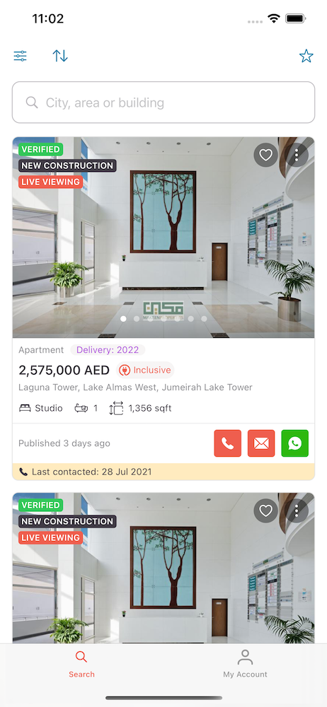

# Property Finder - Tech Interview

Congratulations on reaching the Tech interview stage! 🥳 As your interviewees most probably told you, the **Property Finder - Tech Interview** is scheduled for **60 min** and roughly split into the following parts:

* **10 min**: Introduction 👥
* **45 min**: Task 🏡
* **5 min**: Q&A ❓

---

It is unnecessary to complete all the tasks 💯% (even though it would be pretty impressive). Our idea is to evaluate your working style:

* **How you structure your code**
* **How you are tackling specific tasks**
* etc.

We put together a very lite version of our beloved Property Finder application, without any backend functionality, tracking, logging, and all the other stuff... just basic UI of two out of many screens of the actual application.

---

## Task - Rebuild the following UI in SwiftUI

### Notes

* The list should scroll beneath the search bar
* Each button should only print a short statement to the console
* The carousel images are in Assets.xcassets

### Design Remarks
* Corner Radius: `Multiples of 4`
* Paddings: `Multiples of 4`
* Spacings: `Multiples of 4`

### Font Remarks
* Tags: `.caption2`
* "2,575,000 AED": `.headline`
* Everything else: `.caption`

---

## Sending the project file back in

At the end of the interview, we will kindly ask you to ZIP the whole project and send it back to:

m.shakeer@propertyfinder.ae